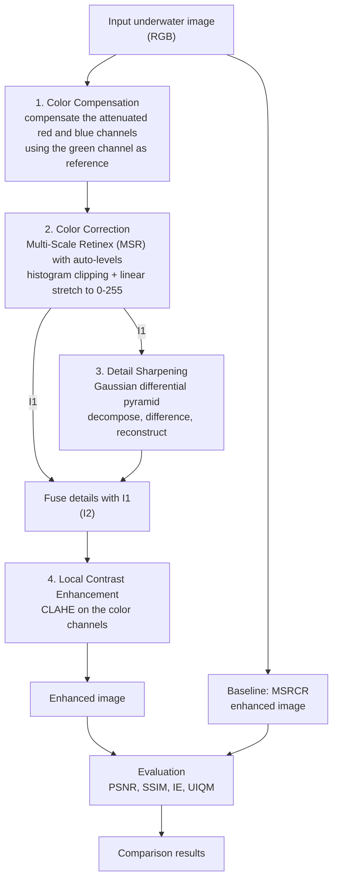
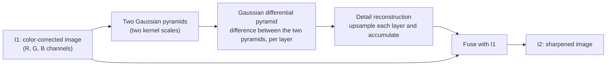

# Underwater Image Enhancement: Color Correction and Local Contrast Enhancement


A Python (OpenCV, Jupyter Notebook) implementation of the four-stage underwater image enhancement method proposed in Jin et al., *"Color Correction and Local Contrast Enhancement for Underwater Image Enhancement,"* IEEE Access, 2022 (see [Reference](#reference)).

## Table of Contents

- [Why underwater images need enhancement](#why-underwater-images-need-enhancement)
- [Architecture and workflow](#architecture-and-workflow)
- [Pipeline stages](#pipeline-stages)
- [Metrics used when comparing with MSRCR](#metrics-used-when-comparing-with-msrcr)
- [Tech stack](#tech-stack)
- [Getting started](#getting-started)
- [Reference](#reference)
- [License](#license)

## Why underwater images need enhancement

Underwater images are central to marine resource exploration, marine ecological research, automatic monitoring, target tracking, and autonomous navigation. But the underwater environment degrades images in ways open-air photos don't suffer from:

- **Color cast.** Water absorbs red light first, over the shortest distance, while blue and green light travel much further. Captured images end up with a green-blue appearance.
- **Blurred details.** Scattering of light softens edges and fine detail.
- **Low contrast.** Suspended particles add noise and backscatter that flatten the image.

Specialized hardware (e.g. underwater lidar) can produce better images but is costly. Software-only techniques such as histogram equalization, wavelet transforms, and plain retinex algorithms each have shortcomings on their own — for example, ordinary histogram equalization can lose image content during enhancement. This project implements a method that combines several complementary techniques to work around those individual weaknesses.

## Architecture and workflow

The pipeline runs four stages in sequence, then the enhanced output is compared against an MSRCR baseline.



### Detail sharpening (stage 3) in more depth



## Pipeline stages

| # | Stage | Problem it addresses | Technique |
|---|-------|----------------------|-----------|
| 1 | Color Compensation | Red light attenuates fastest underwater, blue also attenuates noticeably, giving a green-blue cast | Compensates the red and blue channels using the green channel as a reference |
| 2 | Color Correction | Remaining color cast after compensation | Multi-Scale Retinex (MSR) with auto-levels |
| 3 | Detail Sharpening | Blurred details and edges | Gaussian differential pyramid, fused with the retinex-enhanced image |
| 4 | Local Contrast Enhancement | Uneven pixel balance, noise | CLAHE |

### 1. Color Compensation

Red light has the longest attenuation and shortest transmission distance underwater; blue and green are attenuated less, which is why underwater images look green-blue. This stage compensates both the red and the blue channel, each relative to the green channel, using a compensation factor of α = 1.5 for red and α = 1.0 for blue.

### 2. Color Correction

The color-compensated image can still suffer from blurred details and color distortion. This stage applies an auto-level-based Multi-Scale Retinex (MSR) correction:

1. Compute the gray histogram of the R, G and B channels using auto-levels.
2. Determine the highlight and shadow clipping boundaries for each channel.
3. Apply a linear stretch to the middle part of each channel so every value falls in [0, 255].

The output of this stage is the retinex-enhanced image **I1**.

### 3. Detail Sharpening

To recover the details lost during color correction, this stage reconstructs detail and edge information using a Gaussian differential pyramid:

1. Build two Gaussian pyramids of **I1** using two different kernel scales.
2. Take the difference between the two pyramids at each layer to get the Gaussian differential pyramid.
3. Upsample and accumulate the differential layers to reconstruct the detail image.
4. Fuse the reconstructed detail with **I1** to produce the detail-sharpened image **I2**.

### 4. Local Contrast Enhancement

CLAHE (Contrast Limited Adaptive Histogram Equalization) balances pixel values across the three color channels of **I2**. It limits how much local contrast can be amplified, which suppresses noise while still stretching contrast and preserving detail.

## Metrics used when comparing with MSRCR

This implementation is compared against the existing MSRCR (Multi-Scale Retinex with Color Restoration) method using four metrics:

| Metric | In plain English |
|--------|-------------------|
| **PSNR** | How close the enhanced image is to a reference image. A higher number means less noise or distortion was introduced while enhancing it. |
| **SSIM** | Whether the shapes, edges, and patterns in the image still look natural after enhancement, rather than just checking colors and brightness. A higher score means the structure of the image was preserved well. |
| **IE** | How much detail and variety of information the image contains. A higher number usually means a richer, more detailed picture. |
| **UIQM** | A single score made specifically for underwater photos that combines how colorful, how sharp, and how much contrast the image has. A higher score means a better-looking underwater photo overall. |


## Tech stack

- **Python 3**
- **OpenCV** for image processing
- **NumPy** and **Matplotlib** for array operations and plotting metric comparisons
- **Jupyter Notebook** for the implementation and experiments

## Getting started

```bash
# 1. Clone the repository
git clone https://github.com/<your-username>/<repo-name>.git
cd <repo-name>

# 2. (Optional) create a virtual environment
python -m venv venv
source venv/bin/activate        # Windows: venv\Scripts\activate

# 3. Install dependencies
pip install opencv-python numpy matplotlib jupyter

# 4. Launch the notebook
jupyter notebook
```

Open the notebook, point it at your underwater image(s), and run the cells in order. Each stage of the pipeline (compensation, correction, detail sharpening, contrast enhancement) is a separate step so you can inspect the intermediate result.

## Reference

This project implements the method proposed in:

> S. Jin, P. Qu, Y. Zheng, W. Zhao, and W. Zhang, "Color Correction and Local Contrast Enhancement for Underwater Image Enhancement," *IEEE Access*, vol. 10, pp. 119193–119205, 2022. doi: [10.1109/ACCESS.2022.3221407](https://doi.org/10.1109/ACCESS.2022.3221407)

The paper is published open access under a [Creative Commons Attribution 4.0 License (CC BY 4.0)](https://creativecommons.org/licenses/by/4.0/). This repository does not reproduce any figures from the paper; only the described method is implemented here.

## License

MIT
